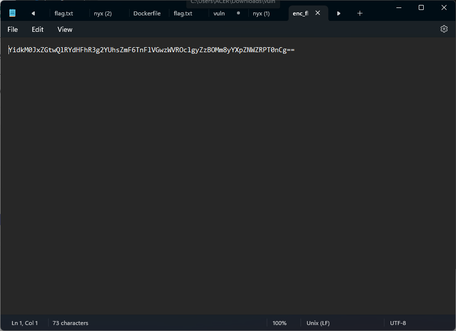

# interencdec
### Author: NGIRIMANA Schadrack

## Description
Can you get the real meaning from this file. 
Download the file [here.](https://artifacts.picoctf.net/c_titan/108/enc_flag)

## Solution
1. Setelah kita mengunduh file yang diberikan, kita dapat membukanya dengan **Notepad** biasa. Akan terlihat kode seperti ini.   

 
2. Dari yang terlihat, kode ini dienkripsi menggunakan enksripsi **Base64**. Langsung saja kita gunakan tool **Base64 Decoder** dari website [cryptii](https://cryptii.com/pipes/caesar-cipher).
Setelah itu, masukkan kode yang ada di file tadi.  

 
4. Kelihatannya, output yang didapat masih dalam bentuk **base64**. Tapi, kita abaikan huruf di luar tanda `''`. Sehingga, kita akan mendekripsi kode `d3BqdkpBTXtqaGx6aHlfazNqeTl3YTNrX2g0N2o2azY5fQ==`.   

 
5. Wow, kode yang dihasilkan sudah memiliki format `xxx{flag}`. Sepertinya kita sudah dekat dengan flag. 

